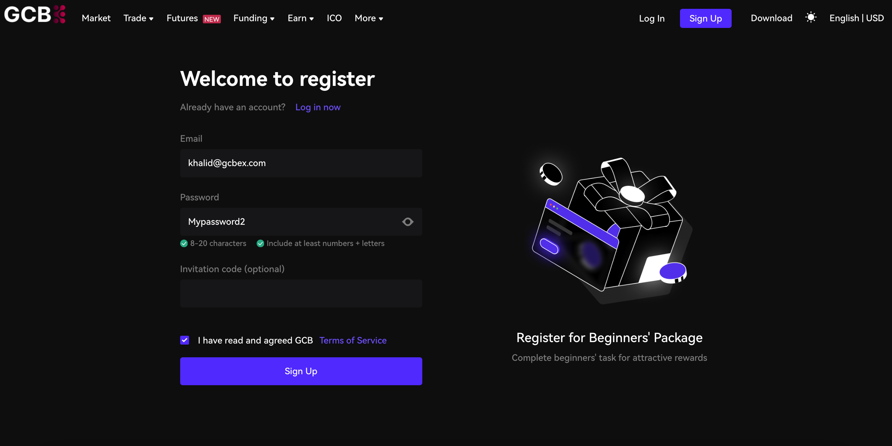

# Boarding

### **Visit Our Exchange Website**:

Go to our official exchange website: [https://www.gcbex.com](https://www.gcbex.com/en_US/register)

<figure><figcaption></figcaption></figure>

#### **Click on “Register”:**

* On the homepage, look for the “Register now!” button.
* Click it to begin the registration process.

### **Provide Required Information:**

* Fill in  your email address.
* Create a secure password for your account.

<figure><figcaption></figcaption></figure>

#### **Complete Identity Verification**:.

* Follow the instructions to verify your identity.

[how-to-kyc.md](how-to-kyc.md "mention")

#### **Confirm Your Registration**:

* Once you’ve provided all the required information, confirm your registration.
* You’ll receive a confirmation email in your inbox.
* please head to your registered email inbox and copy paste the code you received.

#### **Log In to Your New Account**:

* Use your registered credentials to log in to your account.
* Explore the exchange platform and get started!

Remember to keep your login details secure and enable two-factor authentication (2FA) for added security.&#x20;

