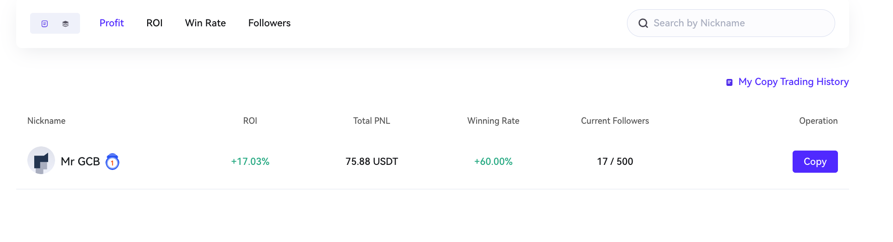
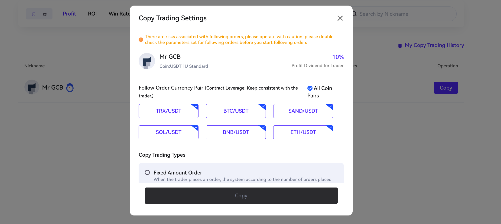

# Copy Trade

### Copy Trading User Guide

#### 1. What is Copy Trading?

Copy Trading is a powerful feature that enables copiers to mimic the trades of multiple elite traders. By automatically aligning with these traders’ trading activities, copiers can potentially generate profits or incur losses. The beauty of copy trading lies in its ability to save users from the hassle of manually opening and closing positions and constantly monitoring the market. When you copy a trader, all their trades are replicated automatically.

#### 2. Types of Copy Trading

**2.1 Copy by Fixed Amount**

With this method, you directly copy the number of orders placed by the trader. If your account balance is insufficient, the maximum number of orders you can place is calculated based on your available balance.

**2.2 Copy by a Fixed Percentage**

In this approach, the “Order Amount” is calculated proportionally. It’s determined by referencing the ratio of each order placed by the trader to their futures balance. Based on this ratio and your desired copy trading amount, the order amount for each trade is calculated using the following formula:

* **Order amount of the follower** = (Trader’s deposit) / (Trader’s available balance) \* (Follower’s copy amount)

Additionally, the opening value for the follower is calculated as:

* **Opening value of the follower** = (Trader’s deposit) / (Trader’s available balance) \* (Follower’s copy amount) \* (Margin multiple)

#### 3. How to Start Copy Trading

Follow these steps to begin copy trading:

1. **Access Copy Trading:**
   * **Web:** Navigate to the Homepage Banner/Earn and select “Copy Trade.”

***

<figure><figcaption></figcaption></figure>

**Step 2: Select a trader**. You can select traders you want to follow.

You can see a list of the traders at the Copy Trade Page with their Nickname, ROI, Total PNL, Winning Rate, Current Followers displayed on the page.

<figure><figcaption></figcaption></figure>

**Step 3:** On the trader's homepage, click "Copy" and enter **Copy Settings**.

* You need to complete the setting before copy any traders.

<figure><figcaption></figcaption></figure>

**4. View my copy trading history**

Click "My Copy Trading History" to **check copy trading data**.

* Overview: It displays "Total Copying Amount", "Income" and "ROL". You can view more details after you scroll down the list.
* Ongoing: It Includes copy trading orders not closed yet.
* Closed: It includes USDT copy trading orders already closed.
* My Following: All the following orders including those that the order opening is not successful yet.

**5. Edit or cancel copy trading orders**

Go to "My Copy Trading Orders" - "Ongoing" and tap the trader you are copying. Click "Stop Copying" to stop copying manually. There are two types to choose from:

If you choose to end the following relationship, once canceled, you will no longer copy the traders' orders and the trader will no longer show on your copying list. Existing copied orders will be closed as the trader closes the orders.

If you choose to only close this order, only this order will be closed, and the following relationship will not be terminated.

***

### Become a Copy Trader Lead?

Sign up & Provide your email address on [port@gcbex.com](mailto:support@gcbex.com), and wait for our confirmation link.&#x20;

