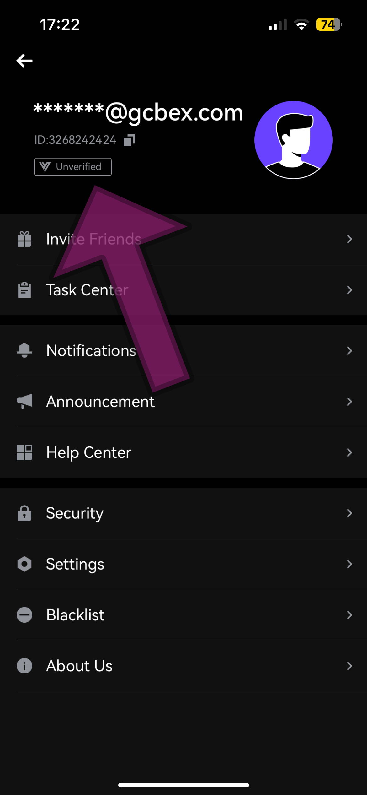
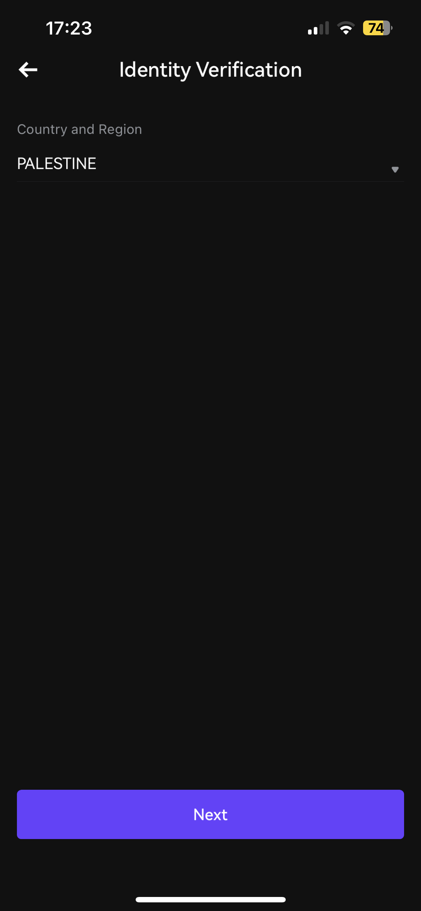
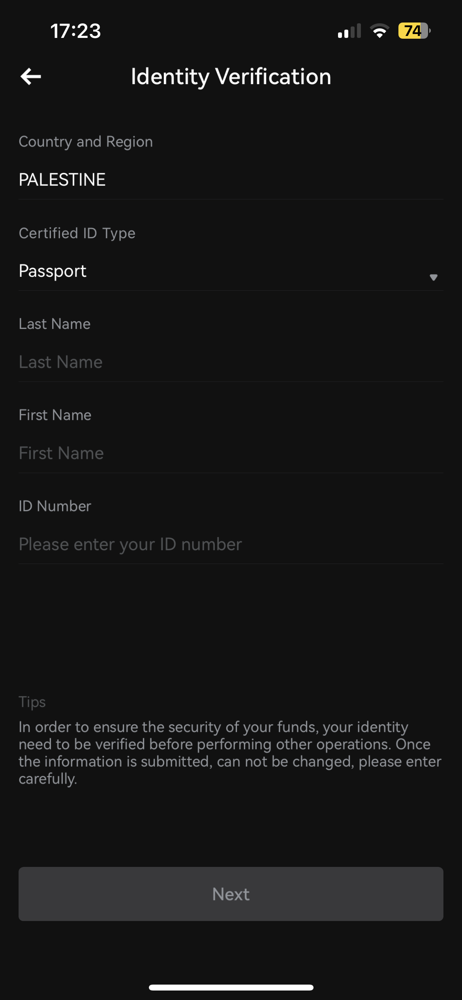
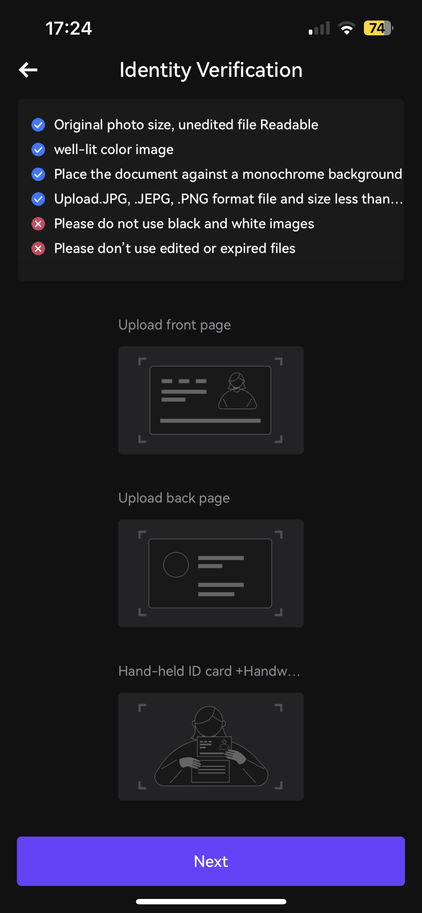
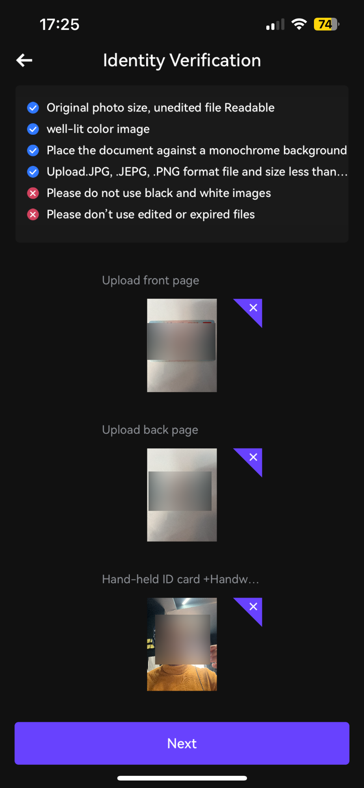
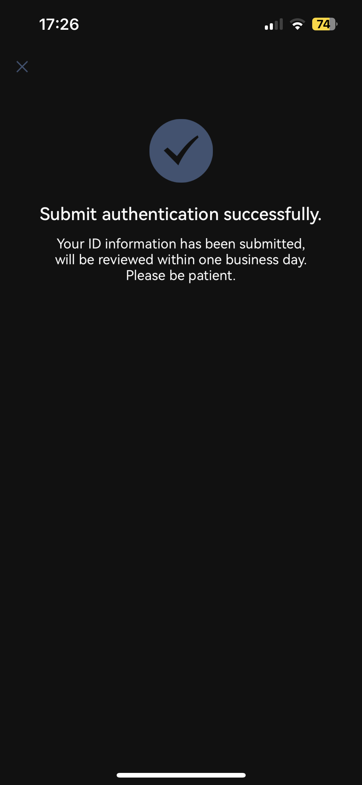

# How To KYC

### GCBex KYC Onboarding Guide

If you have problem signing up follow this link: [https://docs.gcbex.com/documentation/user-guide/boarding](https://docs.gcbex.com/documentation/user-guide/boarding)

If you have problem signing in follow this link: [https://docs.gcbex.com/documentation/user-guide/reset-password](https://docs.gcbex.com/documentation/user-guide/reset-password)

#### Step 1: Log In & Access Your Profile&#x20;

<figure><figcaption></figcaption></figure>

1. **Visit the GCBex Website**: Go to the official GCBex website.
2. **Sign in**: Click on the “Sign in” button and fill in your email, and password.
3. **Verify Email**: Check your email for a verification link from GCBex and click on it to verify your email address.
4. **Access Profile Settings:** Click on the top left corner to access profile.

#### Step 2: Access KYC

1. **Navigate to KYC Section**: From the profile section click on the unverified button.

<figure><figcaption></figcaption></figure>

2. **Navigated to Personal Verification:** Press on Start Verification.

#### Step 3: Identity Verification

1. **Select your National Country**

<figure><figcaption></figcaption></figure>

2. **Select your Certified ID Type:** Passport, ID or Driving License.
3. **Type your identity information:** Type your First name, Last name & ID Number like they figure on your official document.

<figure><figcaption></figcaption></figure>

4. **Upload Identification Documents**:
   * **Government ID**: Upload a clear photo or scan of your passport, driver’s license, or national ID card.
5. **Selfie with ID**: Take a selfie holding your government-issued ID next to your face. Ensure that both your face and the ID are clearly visible.

<figure><figcaption></figcaption></figure>

example:

<figure><figcaption></figcaption></figure>

6. **Submit your KYC.**
7. **Verification Process**: GCBex will review your application. This process may take up to few hours.

<figure><figcaption></figcaption></figure>

#### Step 4: Confirmation

1. **Receive Confirmation**: You will receive an email notification once your KYC application has been approved.
2. **Start Trading**: After approval, you can start using all the features of GCBex, including trading and withdrawals.

<figure><figcaption></figcaption></figure>

#### Tips for a Smooth KYC Process

* **Ensure Clarity**: Make sure all uploaded documents are clear and legible.
* **Use Accurate Information**: Ensure that the information you provide matches your official documents.
* **Check Email Regularly**: Keep an eye on your email for any updates or requests for additional information from GCBex.

***

Following these steps will help you complete the KYC process smoothly and start using GCBex without any hassle. If you encounter any issues, GCBex’s customer support is always there to assist you on the following email address: [support@gcbex.com](mailto:support@gcbex.com).
