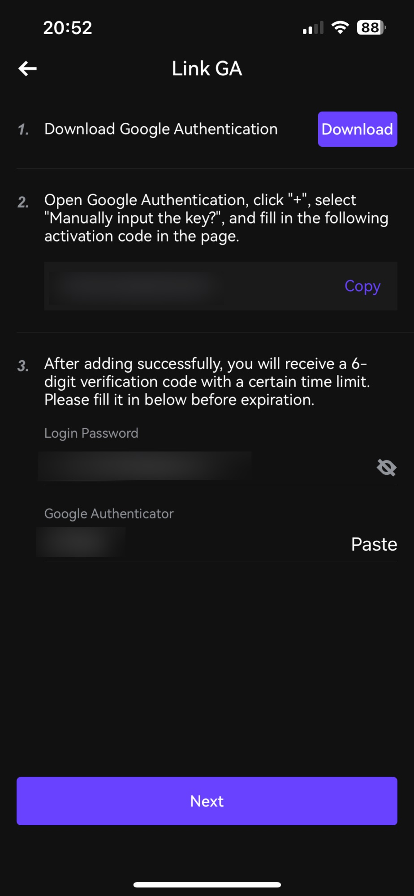

# How to set 2FA

### Two-Factor Authentication (2FA) Setup Guide

#### Step 1: Log In to Your Account

1. **Visit the Website**: [gcbex.com](https://www.gcbex.com/en_US/market)
2. **Log In**: Use your username and password to log in to your account.

#### Step 2: Navigate to Security Settings

1. **Access Account Settings**: Once logged in, go to your profile section.

<figure><figcaption></figcaption></figure>

2. **Find Security Options**: Look for the security which located under profile icon.

<figure><figcaption></figcaption></figure>

3. **Find Security Options**: Look for the Google Authenticator which located under Security.&#x20;

<figure><figcaption></figcaption></figure>

#### Step 3: Set Up Authenticator App (Recommended) Google Authenticator

1. **Download Authenticator App**: Download Google Authenticator from your app store or Play Store through the Download Button.
2. **Copy the Activation code in step 2.**&#x20;

<figure><figcaption></figcaption></figure>

3. **Open Google Authenticator app:** If you need help signing in or up please check with Google support and documentation on the how to.&#x20;
4. **Click the Add Button:** Available in the bottom left of the screen.

<figure><figcaption></figcaption></figure>

5. **Click on Enter a Setup Key:** Showed in the image Bellow&#x20;

<figure><figcaption></figcaption></figure>

6. **Enter Account Name:** You can Choose any account name you see relevant.
7. **Enter Your Key:** You Paste the activation code that was copied from GCBex application.&#x20;
8. **Click on Add.**&#x20;

<figure><figcaption></figcaption></figure>

9. **Copy your 2FA code:** you can copy the code by clicking on the number figuring under your GCBex account name.&#x20;

<figure><figcaption></figcaption></figure>

10. **Type your GCBex login Password.**
11. **Paste 2FA Code:** the code that you copied from the Google Authenticator app.&#x20;
12. **Click the Button Next:** In case it did not work verify that the 2FA code did not expired & that you are typing your GCBex login password before contacting support.&#x20;

<figure><figcaption></figcaption></figure>

***

Following these steps will help you set up Two-Factor Authentication and enhance the security of your account. If you encounter any issues, refer to the help section of the service you’re using or contact our customer support for assistance  [support@gcbex.com](mailto:support@gcbex.com) . Stay safe! 🔒
