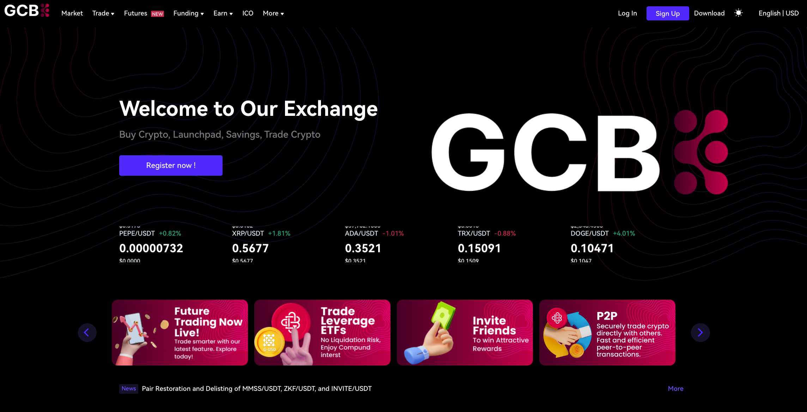

# Introduction

<figure><figcaption>
GCB Exchange
</figcaption></figure>


Sign up with GCB Exchange & benefits from our low trading fee.\
find the link [https://www.gcbex.com/en\_US/register](https://www.gcbex.com/en_US/register)


### Introduction

GCB Exchange is a cutting-edge cryptocurrency trading platform designed to facilitate the trading of digital assets with a strong emphasis on security, efficiency, and scalability. The platform offers a variety of features, including P2P trading, perpetual futures, and leveraged ETFs, catering to a global user base. At the heart of the ecosystem is the GCB Token, which provides utility in trading fees, rewards, and governance. Compliance and user security are paramount, with robust KYC and 2FA systems in place.

### Matching Engine

A crucial component of the GCB Exchange is its matching engine, responsible for efficiently pairing buy and sell orders. It maintains order books and processes trades based on parameters such as price and quantity. The engine ensures low-latency and high-throughput performance, enabling seamless and rapid transactions with the most advanced technology. By leveraging advanced algorithms and technologies, the matching engine supports the exchange’s goal of providing a reliable and scalable trading platform.

### Device Coverage

* **Web-based trading client**
* **Android native client**
* **iOS native client**&#x20;
* **Mobile HTML5 client**&#x20;
* **REST API**

