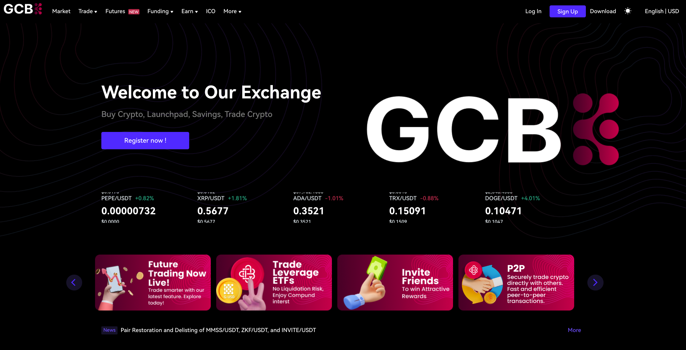

# GCB Exchange

GCB Exchange is a robust and secure cryptocurrency trading platform designed to cater to both novice and experienced traders. The platform offers a wide range of features and services to ensure a seamless trading experience.\
[https://www.gcbex.com/en\_US/market](https://www.gcbex.com/en_US/market)\

<figure><figcaption>
gcbex.com
</figcaption></figure>

#### Key Features

1. **User-Friendly Interface**
   * The platform is designed with an intuitive interface, making it easy for users to navigate and execute trades efficiently.
2. **Wide Range of Trading Options**
   * GCB Exchange supports various trading options including spot trading, P2P trading, perpetual futures, and leveraged ETFs. This diversity allows users to choose the trading method that best suits their needs.
3. **Advanced Matching Engine**
   * The matching engine is a critical component of the exchange, ensuring low-latency and high-throughput performance. It efficiently pairs buy and sell orders, maintaining order books and processing trades based on price and quantity parameters.
4. **Multi-Device Compatibility**
   * GCB Exchange is accessible via multiple devices, including a web-based trading client, Android and iOS native clients, and a mobile HTML5 client. Additionally, it offers a REST API for developers and advanced users.
5. **Security Measures**
   * Security is paramount at GCB Exchange. The platform employs advanced encryption, cold storage for the majority of digital assets, Two-Factor Authentication (2FA), and regular security audits to protect user assets and data.
6. **Compliance and KYC**
   * GCB Exchange adheres to strict Know Your Customer (KYC) protocols to verify user identities and prevent fraudulent activities. This ensures a secure and compliant trading environment.
7. **Customer Support**
   * The platform provides 24/7 customer support to assist users with any issues or inquiries, ensuring a smooth and reliable trading experience.

***

### Revenue Model

| Source         | Description                                                                                                                                                                                                                                                                        |
| -------------- | ---------------------------------------------------------------------------------------------------------------------------------------------------------------------------------------------------------------------------------------------------------------------------------- |
| Exchange Fee   | GCB initially will charge a <mark style="color:blue;">0.4</mark>% fixed fee per trade. Other variations will be subsequently introduced, including maker-taker, volumed based tiering and 0 fee promotions. We have no plan to charge above <mark style="color:blue;">0.4</mark>%. |
| Withdrawal Fee | GCB may charge a small fee for withdrawals.                                                                                                                                                                                                                                        |
| Listing Fee    | GCB will select innovative coins and other assets to be listed on the exchange, there may be a fee associated with those listings.                                                                                                                                                 |
| Leverage Fee   | If you trade on leverage, there may be a fee or interest on the borrowed amount.                                                                                                                                                                                                   |
| Other Fees     | There may be other fees the platform may collect for various services..                                                                                                                                                                                                            |
