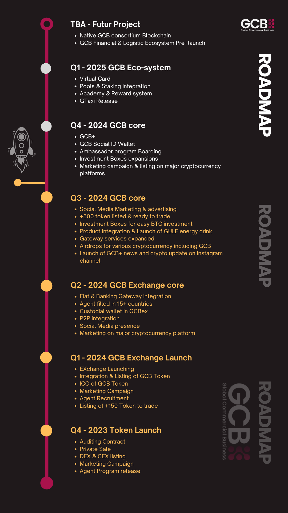

# Roadmap

GCB is an innovative ecosystem designed to bridge the gap between traditional fiat currencies and the world of cryptocurrencies. Our native currency, the GCB token, powers a comprehensive suite of services, from digital wallets and marketplaces to transportation, travel, tourism, and e-commerce. Our mission is to connect users in both developing and developed countries, ensuring seamless access to the financial system and fostering global economic inclusion.

## GCB - Roadmap

<figure><figcaption></figcaption></figure>
